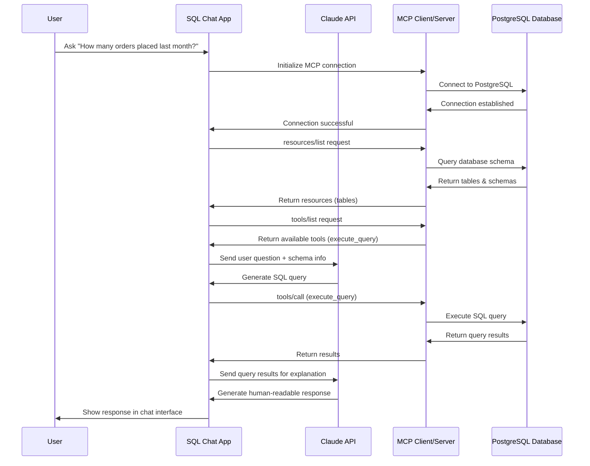
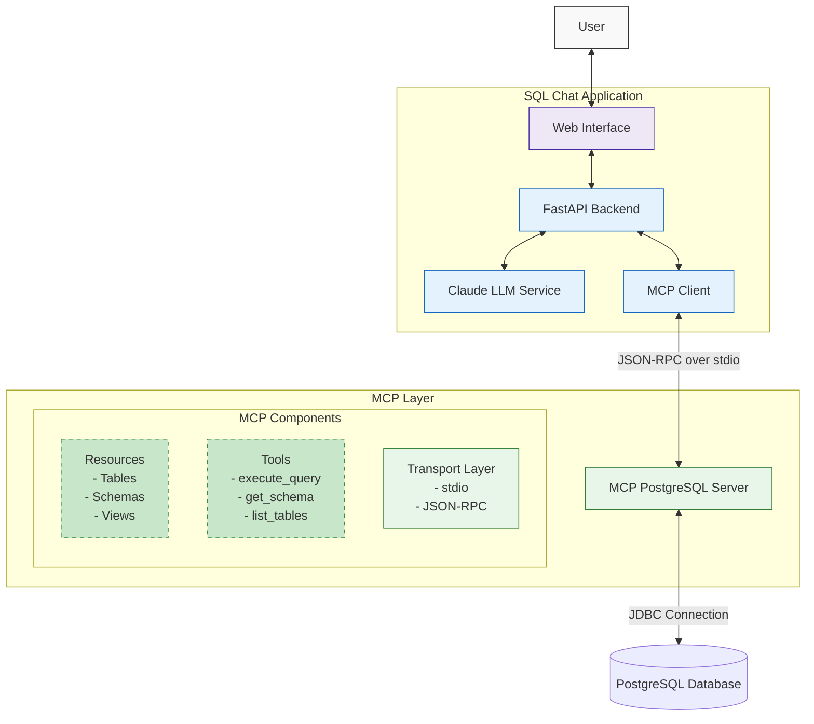

# MCP PostgreSQL Chat

A chat application that connects to your PostgreSQL database using Model Context Protocol (MCP), allowing users to ask questions about their data in natural language using Claude's AI capabilities.

## Features

- Natural language interface to your PostgreSQL database
- Real-time conversation with streaming responses
- Secure access to database schema and data
- Database schema browser
- Interactive chat interface

## Architecture

The application consists of:

1. **FastAPI Backend**: Handles user requests and integrates all components
2. **MCP PostgreSQL Server**: Provides secure database access through MCP
3. **Claude AI Integration**: Processes natural language and generates responses
4. **Web Interface**: Provides a user-friendly chat experience

## How It Works!!



### FlowChart



## Prerequisites

- Python 3+
- PostgreSQL database
- Anthropic API key (for Claude)

## Installation

1. Clone the repository:
   ```bash
   git clone https://github.com/nshantha/SqlAI.git
   cd SqlAI
   ```

2. Install dependencies:
   ```bash
   pip install -r requirements.txt
   ```

3. Install Node.js (required for NPX):
   Make sure you have Node.js installed, as we'll use NPX to run the MCP PostgreSQL server.
   You can download it from: https://nodejs.org/

4. Create a `.env` file based on `.env.example`:
   ```bash
   cp .env.example .env
   ```

5. Edit the `.env` file with your database credentials and Anthropic API key:
   ```
   # Example for Nordstrom JDBC URL
   DB_JDBC_URL=
   DB_USER=your_username
   DB_PASSWORD=your_password
   ANTHROPIC_API_KEY=your_anthropic_api_key
   ```

## Usage

1. Start the application:
   ```bash
   python -m app.main
   ```

2. Open your browser and navigate to:
   ```
   http://localhost:8000
   ```

3. Start chatting with your database!

## Example Queries

You can ask questions like:

- "What tables are in the database?"
- "How many users registered last month?"
- "Show me the top 5 products by revenue"
- "What's the average order value by category?"
- "When was the last order placed?"

## How It Works

1. User sends a question through the chat interface
2. The application forwards the question to Claude
3. Claude uses MCP tools to:
   - Explore the database schema
   - Formulate appropriate SQL queries
   - Execute the queries
   - Interpret the results
4. Claude generates a natural language response
5. The response is displayed to the user

## Customization

You can customize the application by:

- Modifying the system prompt in `app/llm_service.py`
- Adjusting the UI in the templates and static files
- Adding additional database-specific tools
- Implementing authentication for multi-user support

## Security Considerations

This application follows security best practices:

- Database credentials are never exposed to the LLM
- MCP ensures controlled access to database operations
- All queries go through the MCP server's validation
- The UI implements proper input sanitization

## Troubleshooting

If you encounter issues:

1. Check your PostgreSQL connection string
2. Verify your Anthropic API key is valid
3. Ensure the MCP server is installed correctly
4. Check the application logs for errors

## Acknowledgements

- [Model Context Protocol](https://modelcontextprotocol.io/)
- [Anthropic Claude](https://www.anthropic.com/claude)
- [FastAPI](https://fastapi.tiangolo.com/)
- [PostgreSQL](https://www.postgresql.org/)